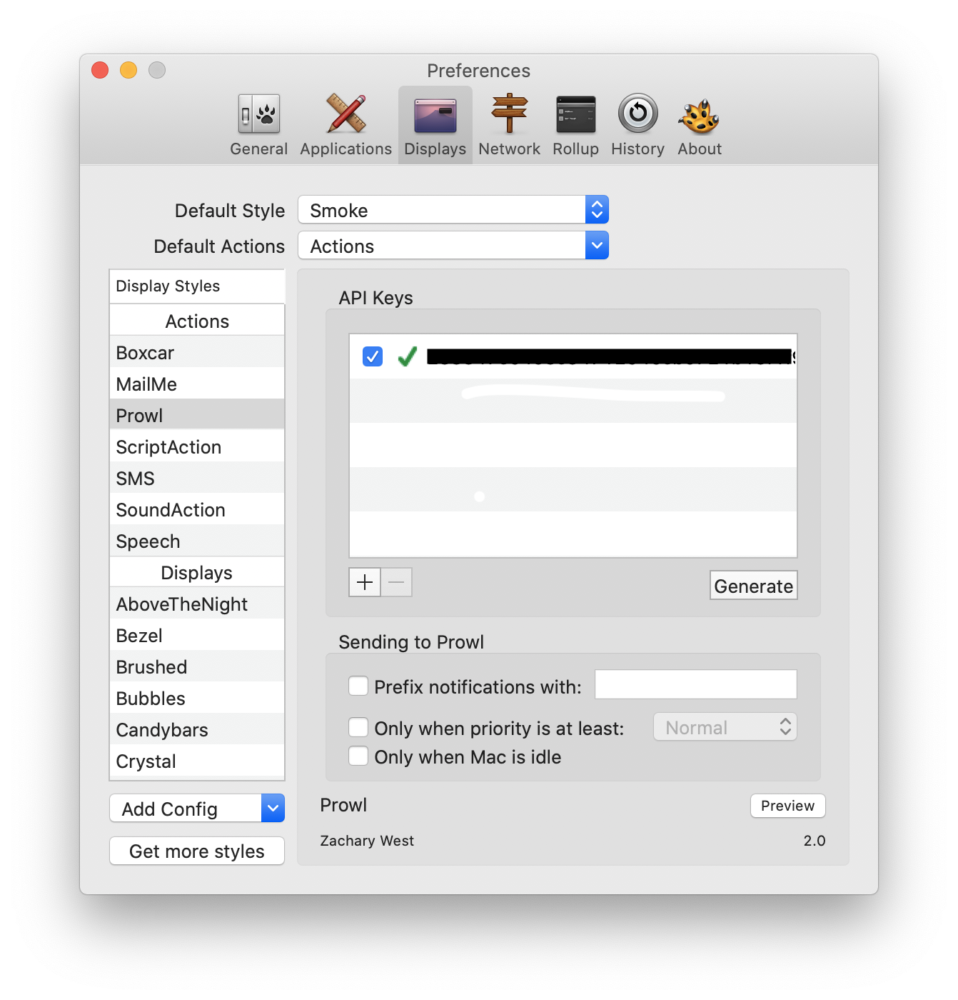

#  MoodleScraper

## Overview

This python script will check your HW grades on moodle periodically and send you a notification whenever a new grade arrives. 

## Getting Started

1. Register at https://www.prowlapp.com/register.php
2. Download Growl from the Mac app store
3. Open the Growl app -> click on Displays -> under actions choose Prowl.
4. Under the API Keys section, choose Generate.

5. Download Prowl app from the App Store and login with the same account.
6. Clone this repository and run `pip3 install -r requirements.txt` to install the dependencies.
7. Fill in your username and password in `NotifyGrade.py`
8. Run `NotifyGrade.py`

# Prerequisites

Python 3.x

## Note:

Only works on Mac computers and iPhones.
This script must always run on your computer with internet connectivity.

